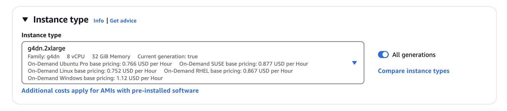
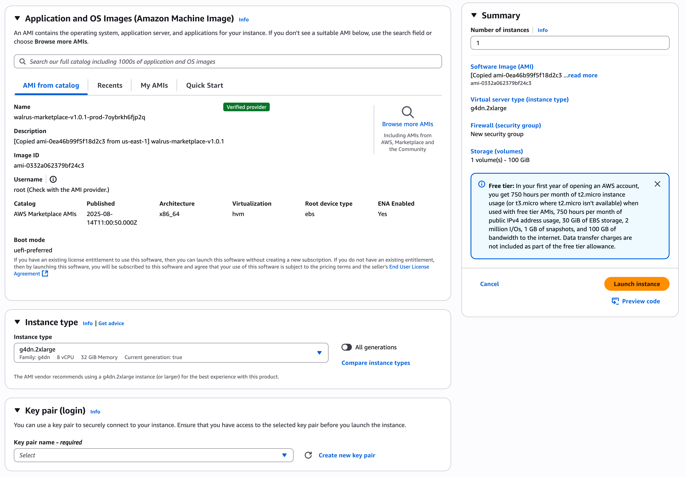

**Table Of Contents**

[1 CREATING AN INSTANCE WITH Walrus AMI](#1-creating-an-instance-with-walrus-ami)<br/>
[2 TRY OUR SR SOLUTIONS](#2-try-our-walrus-solution)<br/>
[3 REFERENCES](#3-references)<br/>

---

# 1 Creating an instance with Walrus AMI

## PROCEDURE

### Step 1. Choose the AMI we shared

- Click “Launch instance” in EC2 console
- Type "Walrus" in the search box and select it.

### Step 2. Choose g4dn.2xlarge instance

choose g4dn.2xlarge
<br/>

<br/>

### Step 3. Review and launch the instance

- Create a private key if you have no existing key and download it.
  <br/>
  
  <br/>
- Click "Launch Instances"

### Step 4. Connect to your instance

```bash
chmod 600 <private_key_path>
ssh -i <private_key_path> ubuntu@<ip_address>
```

Then you can see the following messages:

```
           ██     ██  █████  ██      ██████  ██    ██ ███████
           ██     ██ ██   ██ ██      ██   ██ ██    ██ ██
           ██  █  ██ ███████ ██      ██████  ██    ██ ███████
           ██ ███ ██ ██   ██ ██      ██   ██ ██    ██      ██
            ███ ███  ██   ██ ███████ ██   ██  ██████  ███████

                                                     https://blue-dot.io
                                                     contact@blue-dot.io
#### HOWTO ####
ffmpeg -i 720p_sports.mp4 -vf bdwalrus_aws -c:v libx264 output.mp4

sample clips
- 720p_sports.mp4
- 720p_musicvideo.mp4
```

# 2 Try our Walrus solution

### Options

1. `gamma` : Controls SR generation strength (range: 0 ~ 1)
   - `0.5`(default) : Balanced, preserves details while generating
   - `0`: Minimize info loss from original
   - `1`: Applies strong generation-based SR even if it differs from the original
2. `prompt` : Select SR mode by input video type
   - `null`(Default) : General-purpose
   - `generate`: AI-generated videos
   - `cctv` : CCTV footage
   - `face` : Face videos
   - `sports` : Sports videos

### ffmpeg with default options

```bash
ffmpeg -hide_banner -y -i 720p_musicvideo.mp4 -vf bdwalrus_aws -c:v libx264 output.mp4
```

#### ffmpeg with custom options

```bash
### gamma - 0
ffmpeg -hide_banner -y -i 720p_musicvideo.mp4 -vf bdwalrus_aws=gamma=0 -c:v libx264 output.mp4

### prompt - sports
ffmpeg -hide_banner -y -i 720p_sports.mp4 -vf bdwalrus_aws=prompt=4 -c:v libx264 output.mp4

### gamma - 0, prompt - sports
ffmpeg -hide_banner -y -i 720p_sports.mp4 -vf bdwalrus_aws=gamma=0:prompt=4 -c:v libx264 output.mp4
```

#### Select GPU to use

Similar to the bluedot.sh script, you can also set CUDA_VISIBLE_DEVICES=X before executing ffmpeg commands to select a specific GPU.

```bash
### Use 1st GPU
CUDA_VISIBLE_DEVICES=0 ffmpeg -hide_banner -y -i 720p_musicvideo.mp4 -vf bdwalrus_aws -c:v libx264 output.mp4

### Use 2nd GPU
CUDA_VISIBLE_DEVICES=1 ffmpeg -hide_banner -y -i 720p_musicvideo.mp4 -vf bdwalrus_aws -c:v libx264 output.mp4
```

# 3 References

## Using the terminal in VS Code

Because the terminal in VS Code starts as a non-login shell, run the following command:

```
bash -l
```

## bdwalrus filter options

```
Filter bdwalrus_aws
  Walrus v2. GPU version (C)BLUEDOT.
    Inputs:
       #0: bdwalrus_aws_in (video)
    Outputs:
       #0: bdwalrus_aws_out (video)
bdwalrus_aws AVOptions:
   gamma             <float>      ..FV....... gamma: n (from 0 to 1) (default 0.5)
   prompt            <int>        ..FV....... prompt: 0(null), 1(generate), 2(cctv), 3(face), 4(sports) (from 0 to 4) (default 0)
```

# 4 Use Cases for Walrus AMI with AWS Elemental

The Walrus AMI is a GPU-based AMI that enhances the quality of low-resolution videos, including upscaling and noise reduction. This document describes a representative integration use case using AWS Elemental MediaConvert.

### [Use case : S3 → Walrus → MediaConvert](./use-cases/vod.md)
